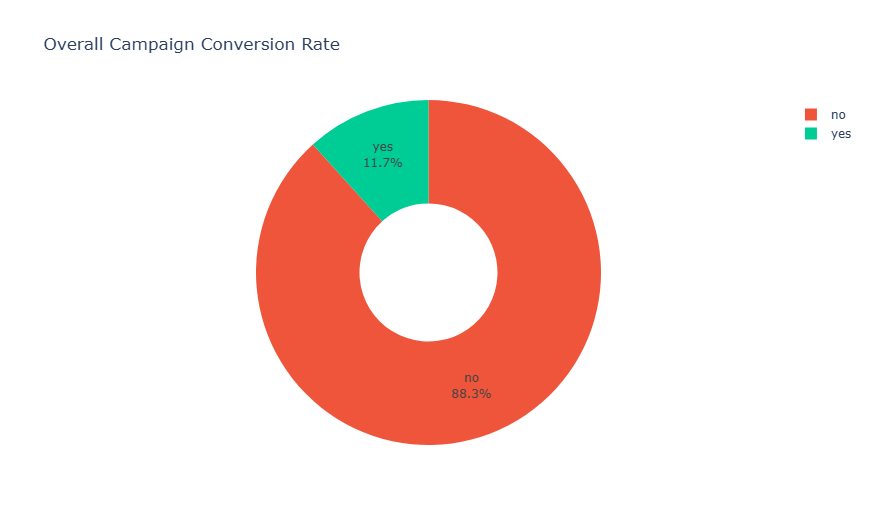
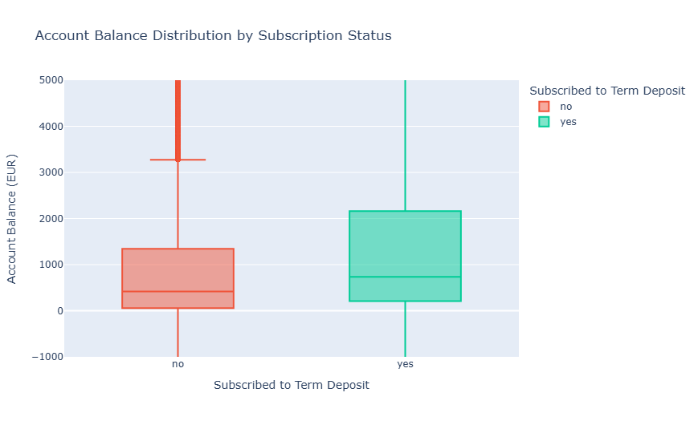

# Bank Telemarketing Optimizaation
This project analyzes a dataset related with direct marketing campaigns of a Portuguese banking institution. The marketing campaigns were based on phone calls. Often, more than one contact to the same client was required, in order to access if the product (bank term deposit) would be ('yes') or not ('no') subscribed.

Dataset source: UCI Machine Learning Repo Bank Marketing
https://archive.ics.uci.edu/dataset/222/bank+marketing

## Problem Statement
Telemarketing campaigns often suffers from low conversion rates and high operational costs due to uninterested leads. Contacting every customer in the database also might be not an effective approce with the limited resources. There is a need to identify the profile of custommer who likely to subscribe to the product.

## Objective
To predict whether a client will subscribe to a term deposit. By identifying several indicators, this project aims to:
- Increase conversion rate, by focusing marketing efforts on high probability lead.
- Optimize resource allocation, reduce the number of unnecessary calls or low probability client, so it can lowering the operational cost.
- Understand which factors that most significantly influence client decision

## Insights from EDA
### Overall Conversion Rate

There is a significant rejection rate of 88.3% compared to 11.7% conversion rate which suggest that the current calling strategy is still inefficient. This indicates a clear need a more targeted client, data driven approach  rather than contacting every client from the database.

### Annual Account Balance Distribution

Clients who chose to subscribe the offer have a higher median balance compared to those who rejected it. It indicates that clients with high liquidity tend to prefer using deposits.

