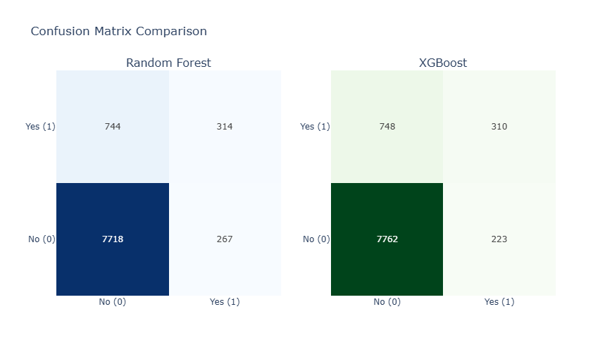
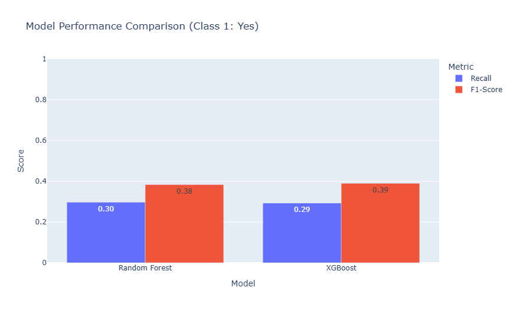

# Bank Telemarketing Optimizaation
This project analyzes a dataset related with direct marketing campaigns of a Portuguese banking institution. The marketing campaigns were based on phone calls. Often, more than one contact to the same client was required, in order to access if the product (bank term deposit) would be ('yes') or not ('no') subscribed.

Dataset source: UCI Machine Learning Repo Bank Marketing
https://archive.ics.uci.edu/dataset/222/bank+marketing

## Problem Statement
Telemarketing campaigns often suffers from low conversion rates and high operational costs due to uninterested leads. Contacting every customer in the database also might be not an effective approce with the limited resources. There is a need to identify the profile of custommer who likely to subscribe to the product.

## Objective
To predict whether a client will subscribe to a term deposit. By identifying several indicators, this project aims to:
- Increase conversion rate, by focusing marketing efforts on high probability lead.
- Optimize resource allocation, reduce the number of unnecessary calls or low probability client, so it can lowering the operational cost.
- Understand which factors that most significantly influence client decision

## Insights from EDA
### Overall Conversion Rate

There is a significant rejection rate of 88.3% compared to 11.7% conversion rate which suggest that the current calling strategy is still inefficient. This indicates a clear need a more targeted client, data driven approach  rather than contacting every client from the database.

### Annual Account Balance Distribution

Clients who chose to subscribe the offer have a higher median balance compared to those who rejected it. It indicates that clients with high liquidity tend to prefer using deposits.

### Conversion Rate based on Number of Calls

Conversion rates reached the peak at the first contact, remain stable through the second and third attempts before decreasing significantly in subsequent calls. It suggest that a threshold of three attempts per campaign should be more effective to prevent customer fatigue. p.s the maximum 6 attemps in this graph is the result of capping to reduce the outliers. 

### Client Demographic Distributon

The campaign primarily reaches clients in the 30–40 age bracket, representing the highest volume of contacts. However, this demographic also yields the highest rejection.

From the occupation, students and retired clients show the highest conversion rates compared to others. This can be an indication that groups with specific financial life stages are a good target for this product.

Clients with tertiary education demonstrate a higher conversion rate compared to others. This might suggest that higher financial literacy or more stable professional income levels contribute to decision making for long term investment. 

From this three indicators, while high education levels positively correlate with higher conversion rates, this effect still influenced by client's life stage. The 30-40 age group, despite being well-educated, they often faces the middle-age financial squeeze that might override their will to save. But, for the student and retired segments, they represent high-conversion due to lower debt or loan burdens and probably have more specific financial goals.

The assumption of loan burdens indicated in this graph below where client that has housing loan and/or personal loan tend to reject the subscription. 

## Modeling
For the model selection, XGBoost and Random Forest were compared. 
### Model Performance Comparison

| Model | Class | Precision | Recall | F1-Score | Accuracy |
| :--- | :--- | :---: | :---: | :---: | :---: |
| **Random Forest** | 0 (No) | 0.912 | 0.967 | 0.939 | 0.888 |
| | 1 (Yes) | 0.540 | 0.297 | 0.383 | |
| **XGBoost** | 0 (No) | 0.912 | 0.972 | 0.941 | **0.893** |
| | 1 (Yes) | **0.582** | 0.293 | **0.390** | |

"XGBoost demonstrates higher Precision (58.2%) compared to Random Forest for Class 1 (Yes). From a reliability perspective, although the Recall remains low (0.29) due to the intentional removal of the 'duration' feature, XGBoost achieved higher F1-score, indicating more stable and balanced model performance

### Feature Importance
Based on the XGBoost model, some key drivers of client decisions:
- Housing Loan: The 'housing' feature has the highest influence compared to others. This result aligns with the early EDA findings that loans can be a financial burden. Clients with housing loans tend to have lower financial flexibility to commit to long-term deposits. 
- Previous Campaign Success: The 'poutcome_success' feature is the second strongest predictor. Clients who have previously said 'yes' may have higher trust in the institution, making them an ideal target for future campaigns
- Marital Status (Married): Clients who are married tend to prioritize long-term financial instruments like deposits more than single clients
- Personal Loan: This feature 'loan' also confirms that financial burdens lower the probability of a client subscribing to long-term deposits.

## Business Impact Simulation
To evaluate the model's performance in a real-world business context, a simulation was conducted comparing a traditional marketing approach with a data-driven strategy.

**Assumptions:**
- Cost per Call $1.00 USD
- Profit per Subcription (Yes): $50.00 USD

| Metric | Massive Campaign (Baseline) | Model-Driven (XGBoost) | Improvement / Difference |
| :--- | :---: | :---: | :---: |
| **Total Calls Made** | 9,043 | **533** | **-94.1% Cost Reduction** |
| **Total Conversions** | 1,058 | 310 | (Focused High-Prob Leads) |
| **Total Cost** | $9,043 | **$533** | Savings: $8,510 |
| **Total Revenue** | $52,900 | $15,500 | - |
| **Net Profit** | $43,857 | $14,967 | - |
| **Operational ROI** | **4.85x** | **28.08x** | **5.8x Higher Efficiency** |

While the massive campaign captures more customers in total volume, it is highly inefficient with a high usage of resources. The data-driven approach using XGBoost demonstrates a superior ROI of 28.08x, allowing the bank to achieve significant profitability with minimal operational expenditure. This strategy is ideal for optimizing sales team productivity and minimizing customer fatigue from unnecessary calls

## Note
The current model can be seen as highly efficient as it targets 5.9% of total clients, but this model is conservative where only primarily focuses on high-precision conversion which can be a problem for scalability. However, the probability threshold still can be adjujsted, lowering it can capture more potential (increasing recall at trade off decrease in precision). This flexibility of threshold allows the model to adapt whether it should go on maximum efficiency or maximum volume. 

